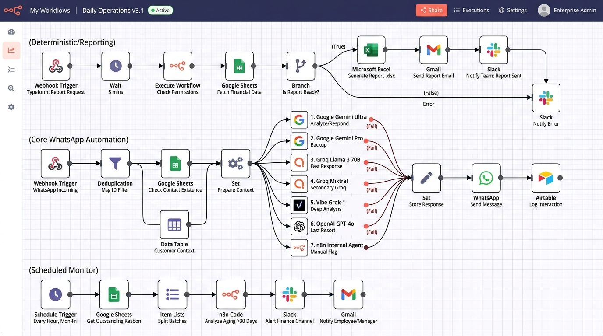

# UMKMense Pro: AI Financial Agent (WhatsApp Edition)

> Asisten Finansial Multimodal Berbasis WhatsApp untuk Otomasi Pembukuan, Ekstraksi Nota, dan Manajemen Kasbon UMKM Indonesia.



---

## Ringkasan Proyek

**UMKMense Pro** adalah agen keuangan cerdas berbasis n8n dan Evolution API yang dirancang untuk mengatasi masalah mendasar jutaan pelaku UMKM di Indonesia: **pencatatan arus kas yang sering terabaikan karena keterbatasan waktu dan rumitnya aplikasi akuntansi manual.**

Pengguna cukup mengirimkan pesan melalui WhatsApp—baik berupa **pesan teks, rekaman suara (voice note), maupun foto nota/struk fisik**. Sistem secara otomatis memvalidasi, mengekstrak entitas finansial, mencatat ke buku besar data table, menyajikan ringkasan laporan laba-rugi, mengekspor laporan ke file Excel spreadsheet (.xlsx), serta memonitor piutang/kasbon pelanggan secara terjadwal tanpa intervensi manual.

---

## Keunggulan Arsitektur

1. **Zero Downtime 7-Tier AI Cascade:**
   * Tier 1: Google Gemini Flash (Akun Utama)
   * Tier 2: Google Gemini Flash (Akun Cadangan 1)
   * Tier 3: Google Gemini Flash (Akun Cadangan 2)
   * Tier 4: Groq Cloud LPU (LLaMA-3.3 70B OSS - Failover Kuota Bebas Batas)
   * Tier 5: Vibe AI Model (Cadangan Darurat - Sekai Gateway)
   * Tier 6: Vibe Grok 4.5
   * Tier 7: Vibe Grok 4.6
2. **Multimodal Native Input:**
   * Menerima audio voice note WhatsApp (maksimal 8 MB).
   * Menerima gambar struk, nota thermal, dan invoice fisik (maksimal 10 MB).
   * Menerima instruksi teks alami berbahasa Indonesia/daerah santai.
3. **Idempotensi & Anti-Duplikasi Event:**
   * Deduplikasi berbasis `messageId` mencegah pencatatan transaksi ganda jika WhatsApp melakukan *retry webhook*.
4. **Jalur Cepat Deterministik (Cost & Latency Saver):**
   * Perintah umum (Menu, Bantuan, Sapaan) dan Laporan Standar diproses deterministik tanpa memanggil model LLM, menghemat 100% token dan merespons dalam < 500 ms.
5. **Ekspor Spreadsheet Otomatis (.xlsx):**
   * Mengonversi riwayat transaksi pengguna menjadi file Excel resmi yang langsung dikirimkan kembali ke chat WhatsApp.
6. **Autonomous Kasbon Reminder Engine:**
   * Cron scheduler independen yang memonitor transaksi bertipe piutang (*kasbon*) dan mengirimkan notifikasi penagihan berkala ke kontak terkait secara otomatis.

---

## Panduan Lengkap Mendapatkan API Key & Pengaturan

### 1. Vibe AI / Sekai Gateway (Gratis via Telegram Bot)
Model Vibe AI berfungsi sebagai *failover* darurat tingkat lanjut (termasuk akses model Grok dan GPT-5.6 Luna) tanpa biaya langganan.

* **Cara Mendapatkan API Key:**
  1. Buka aplikasi Telegram dan akses bot: [https://t.me/sekai_gatewaybot](https://t.me/sekai_gatewaybot) (atau cari `@sekai_gatewaybot`).
  2. Klik atau kirim pesan: `/start`.
  3. Pilih menu pengambilan API key gratis yang disediakan bot.
  4. Salin kunci API yang diawali dengan `sk-...` (contoh: `sk-b95891...`).
* **Pengaturan di n8n:**
  1. Masuk ke **n8n → Credentials → Add Credential**.
  2. Pilih jenis credential: **OpenAI API**.
  3. Beri nama: `Vibe madewgn.dev API`.
  4. Masukkan **API Key** yang didapat dari bot Telegram.
  5. Pada kolom **Base URL**, masukkan: `https://vibe.madewgn.dev/v1`
  6. Model yang digunakan pada node workflow:
     * `free/gpt-5.6-luna` (Tier 5)
     * `free/grok-4.5` (Tier 6)
     * `free/grok-4.6` (Tier 7)

---

### 2. Google AI Studio (Gemini Flash & Pro)
Gemini menangani analisis multimodal berkecepatan tinggi untuk pemrosesan teks, audio voice note, dan OCR nota struk belanja.

* **Cara Mendapatkan API Key:**
  1. Kunjungi portal resmi: [https://aistudio.google.com/](https://aistudio.google.com/).
  2. Masuk menggunakan akun Google Anda.
  3. Klik tombol **Get API key** di bilah kiri, lalu klik **Create API key**.
  4. Salin token API yang diawali dengan `AIzaSy...`.
  5. *(Rekomendasi Pro)*: Buat hingga 3 API key dari project atau akun berbeda untuk mengaktifkan fitur rotasi multi-tier failover.
* **Pengaturan di n8n:**
  1. Masuk ke **n8n → Credentials → Google Gemini Chat Model** (atau `googlePalmApi`).
  2. Buat 3 akun kredensial terpisah:
     * `Google Gemini - Utama` (API Key 1)
     * `Google Gemini - Cadangan 1` (API Key 2)
     * `Google Gemini - Cadangan 2` (API Key 3)
  3. Model default: `models/gemini-2.5-flash` atau `models/gemini-1.5-flash`.

---

### 3. Groq Cloud (LLaMA-3.3 70B - Penyelamat Kuota)
Groq LPU digunakan saat kuota Gemini mencapai batas (*rate limit 429*). Groq menyediakan pemrosesan super cepat dengan kuota gratis hingga 14.400 permintaan per hari.

* **Cara Mendapatkan API Key:**
  1. Kunjungi konsol Groq: [https://console.groq.com/](https://console.groq.com/).
  2. Daftar atau login menggunakan akun GitHub / Google.
  3. Masuk ke menu **API Keys** → klik **Create API Key**.
  4. Beri nama (misal: `umkmense-groq`) lalu salin token yang diawali dengan `gsk_...`.
* **Pengaturan di n8n:**
  1. Masuk ke **n8n → Credentials → Add Credential → OpenAI API**.
  2. Beri nama: `Groq Cloud API`.
  3. Masukkan **API Key** (`gsk_...`).
  4. Pada kolom **Base URL**, isi: `https://api.groq.com/openai/v1`.
  5. Model yang digunakan pada node: `llama-3.3-70b-versatile`.

---

### 4. Evolution API (Gateway WhatsApp Multi-Device)
Evolution API menjembatani n8n dengan WhatsApp Web secara stabil dan mandiri (*self-hosted*).

* **Cara Menyiapkan & Mendapatkan Kunci:**
  1. Jalankan container Evolution API melalui Docker (port `8080`).
  2. Tentukan `AUTHENTICATION_API_KEY` pada konfigurasi environment Docker (misal: `EVOLUTION_API_KEY=my_secure_secret`).
  3. Buat instance WhatsApp baru melalui HTTP POST ke endpoint:
     ```http
     POST http://127.0.0.1:8080/instance/create
     Headers:
       apikey: <EVOLUTION_API_KEY>
       Content-Type: application/json
     Body:
       {
         "instanceName": "umkmense-bot",
         "token": "bot-token-123",
         "qrcode": true
       }
     ```
  4. Pindai QR code yang dihasilkan menggunakan aplikasi WhatsApp di ponsel (*Linked Devices*).
  5. Hubungkan Webhook instance ke n8n:
     ```http
     POST http://127.0.0.1:8080/webhook/set/umkmense-bot
     Headers:
       apikey: <EVOLUTION_API_KEY>
     Body:
       {
         "enabled": true,
         "url": "http://n8n:5678/webhook/wa-universal-inbound",
         "webhook_by_events": false,
         "events": ["MESSAGES_UPSERT"]
       }
     ```

---

## Arsitektur Alur Kerja (Workflow Diagram)

```
[Zona 2: Laporan Cepat]   Fetch Deterministic -> Build Report -> Send Deterministic Report
                              ^ (True)
[Zona 3: Ekspor Excel]    Fetch Export -> Format Rows -> If Has Data -> Generate Excel -> Convert B64 -> Send WA Doc
                              ^ (True)                             \-> Send No Data Alert
                              |
[Zona 1: Gerbang Ingesti] Webhook -> Normalizer -> Deduplication -> Receipt -> Rate Limit -> [Router Waterfall]
                                                                                                   | (False)
[Zona 4: Fast Menu]       Prepare Instant Response (Menu/Greeting) --------------------------------+----> [Send WhatsApp]
                              ^ (True)                                                             |          ^
                              |                                                                    |          |
[Zona 5: AI Multimodal]   Progress Alert -> Multimodal Ingestion -> [AI Failover Cascade: T1..T7] -+----------+
                          (Tools: insert_tx, get_tx, summary_tool, reminder_tool)

[Zona 6: Kasbon Monitor]  Kasbon Cron Monitor -> Fetch -> Check -> Update -> Persist -> Alert -> Final Persist
                          (Jalur linear terjadwal di latar belakang)
```

---

## Rincian Pipeline & Logika 6 Zona

* **Zona 1: Gerbang Ingesti & Keamanan (Y = 1000):**
  * `WhatsApp Universal Ingestion Webhook`: Menerima pesan masuk mentah dari Evolution API.
  * `WhatsApp Input Normalizer`: Membersihkan payload, mengekstrak sender, isi pesan, tipe media, dan URL lampiran.
  * `Find Existing Inbound Event` & `Drop Duplicate Inbound Event`: Deduplikasi berbasis `messageId` agar tidak terjadi pencatatan dobel.
  * `Send Immediate Receipt`: Memberikan konfirmasi kilat WhatsApp ke pengirim.
  * `Apply Soft Rate Limit` & `If Soft Rate Limit Exceeded`: Proteksi antispam per pengguna.
* **Router Waterfall (X = 10440):**
  * Tangga seleksi bertingkat: `If Is Deterministic Report` → `If Is Export Command` → `If Is Fast Command (Menu/Greeting)` → AI Processing.
* **Zona 2: Jalur Laporan Deterministik (Y = 520):**
  * Menghitung total omzet/pengeluaran langsung via SQLite/Data Table tanpa memakan token LLM.
* **Zona 3: Jalur Ekspor Spreadsheet Excel (Y = 740):**
  * Menghasilkan file Excel (.xlsx), dikonversi ke Base64, dan dikirimkan sebagai lampiran dokumen WhatsApp.
* **Zona 4: Fast Command (Y = 1360):**
  * Membalas pesan navigasi standar (Menu, Bantuan, Sapaan) seketika dalam < 500 ms.
* **Zona 5: AI Multimodal Agent Cascade (Y = 1600):**
  * Mengolah pesan kompleks, nota fisik belanja, dan voice note menggunakan 7 tingkatan failover AI yang saling mem-backup jika terjadi limit kuota.
* **Zona 6: Kasbon Autonomous Scheduled Monitor (Y = 2160):**
  * Cron scheduler independen yang memantau tanggal jatuh tempo piutang dan mengirimkan notifikasi penagihan secara otomatis.

---

## Kebutuhan Sistem & Alat (Requirements & Tools)

### 1. Spesifikasi Perangkat Keras (Hardware Requirements)
* **Local Docker (PC / Laptop):**
  * **RAM:** Minimal 4 GB (Direkomendasikan 8 GB agar Docker Desktop, n8n, Evolution API, Redis, dan PostgreSQL berjalan lancar simultan).
  * **CPU:** Minimal 2 Core (arsitektur x86_64 atau ARM64).
  * **Penyimpanan:** Minimal 10 GB ruang kosong (untuk image container, log eksekusi, dan volume data).
* **VPS / Server Cloud (Jika Self-Host 24/7):**
  * Minimal 1 vCPU / 2 GB RAM (cukup untuk Linux server berbasis terminal tanpa GUI desktop).

### 2. Software & Perangkat yang Diperlukan
1. **Docker Engine & Docker Compose / Docker Desktop:** Menjalankan ekosistem microservices secara terisolasi.
2. **Evolution API (v2):** Gateway mandiri untuk menghubungkan nomor WhatsApp bisnis via multi-device pairing.
3. **Redis:** Cache in-memory penyimpan sesi dan status koneksi WhatsApp.
4. **PostgreSQL / SQLite:** Database relasional penyimpan riwayat transaksi, buku kas, dan event idempotensi n8n.
5. **Tunnel Publik (Khusus Local Docker):** Cloudflare Tunnel atau Ngrok (agar WhatsApp/Evolution API dapat mengirim event webhook masuk ke IP lokal PC).
6. **Kunci API Layanan:**
   * Google Gemini API Key (1 s.d. 3 akun dari Google AI Studio)
   * Groq Cloud API Key (LLaMA-3.3 70B)
   * Vibe AI API Key (via Telegram bot `@sekai_gatewaybot`)

---

## Perbandingan Opsi Deployment: Local Docker vs Cloud n8n

| Parameter | Opsi A: Local Docker (PC/Laptop) | Opsi B: Cloud n8n (n8n.cloud + VPS) |
| :--- | :--- | :--- |
| **Biaya Bulanan** | 100% Gratis (menggunakan komputer sendiri) | Berlangganan (n8n.cloud mulai 20 euro/bln + VPS Evolution $3-$5) |
| **Ketersediaan** | Aktif hanya saat komputer/laptop menyala | Aktif 24/7 tanpa henti (*always-on*) |
| **Hosting WhatsApp** | Evolution API berjalan di Docker lokal | Evolution API dipasang di VPS (DigitalOcean/Hetzer/Railway) |
| **Akses Webhook** | Wajib menggunakan Cloudflare Tunnel / Ngrok | Webhook n8n.cloud otomatis memiliki domain SSL resmi |
| **Kedaulatan Data** | SQLite dan database tersimpan 100% lokal | Tersimpan di cloud infrastructure n8n |

---

## Panduan Deployment

### Opsi A: Local Docker (Self-Hosted)

Seluruh layanan berjalan di dalam satu jaringan internal Docker (`evo_net`):

```
WhatsApp Phone ---> [Internet] ---> Cloudflare Tunnel / Ngrok
                                           |
                                 (Port 8080 / 5678)
                                           v
[Local Docker] ----------------------------------------------------
|  - evolution_api (WhatsApp Gateway) <--> evo_redis               |
|         | (Webhook POST)                                        |
|         v                                                        |
|  - n8n Container (Engine Workflow UMKMense Pro)                  |
|         |                                                        |
|  - SQLite / PostgreSQL (Data Table Transaksi & Idempotensi)      |
-------------------------------------------------------------------
```

1. **Kloning Repositori:**
   ```bash
   git clone https://github.com/ucuk048/umkmense-pro.git
   cd umkmense-pro
   ```
2. **Konfigurasi Environment (.env):**
   Salin berkas template dan masukkan kunci API yang sudah diperoleh:
   ```bash
   cp .env.example .env
   ```
3. **Instalasi & Menjalankan Otomatis 1 Perintah:**
   Pilih salah satu sesuai sistem operasi Anda:

   * **Cara Universal (Docker Compose - Semua OS):**
     ```bash
     docker compose up -d
     ```
     *Perintah ini otomatis mengunduh image, menyiapkan network `evo_net`, membuat volume, dan menyalakan 4 container simultan (Postgres, Redis, Evolution API, dan n8n).*

   * **Pengguna Windows (1-Klik Otomatis):**
     Cukup klik ganda atau jalankan:
     ```cmd
     START_UMKMENSE_BOT.bat
     ```
     *Skrip ini otomatis mendeteksi Docker Desktop, menjalankan docker compose, memelihara database SQLite, mengimpor workflow `workflow_tidied.json`, dan langsung membuka antarmuka n8n di peramban.*

   * **Pengguna Linux / macOS:**
     ```bash
     chmod +x setup.sh && ./setup.sh
     ```

4. **Buka Dashboard Layanan:**
   * **n8n Editor Workflow:** [http://localhost:5678](http://localhost:5678)
   * **Evolution API Dashboard:** [http://localhost:8080](http://localhost:8080)

---

### Opsi B: Cloud n8n (n8n.cloud)

Layanan n8n.cloud adalah SaaS terkelola yang menangani eksekusi workflow secara *always-on* tanpa membutuhkan PC menyala. Karena n8n.cloud tidak mengizinkan penambahan container Docker kustom di layanannya, Evolution API di-hosting secara mandiri di VPS ringan:

```
[Pengguna WhatsApp] ---> [Evolution API di VPS / Railway]
                                     |
                          (HTTPS Webhook Event)
                                     v
                    [n8n.cloud (Workflow Engine)]
                                     |
                        (Gemini / Groq / Vibe APIs)
```

1. **Pasang Evolution API di VPS:**
   Jalankan container Evolution API + Redis di VPS murah (DigitalOcean, Hetzner, atau Railway) yang sudah memiliki IP publik / domain HTTPS.
2. **Import Workflow ke n8n.cloud:**
   * Buka dashboard n8n.cloud Anda.
   * Klik menu **Workflows** → **Add Workflow** → **Import from File**.
   * Pilih berkas `workflow_tidied.json` dari repositori ini.
3. **Isi Kredensial di n8n.cloud:**
   * Masuk ke menu **Credentials** di n8n.cloud.
   * Buat kredensial `Google Gemini Chat Model`, `Groq Cloud API`, dan `Vibe madewgn.dev API`.
4. **Sambungkan Webhook:**
   * Salin URL produksi dari node `WhatsApp Universal Ingestion Webhook` di n8n.cloud (contoh: `https://instansi-anda.app.n8n.cloud/webhook/wa-universal-inbound`).
   * Daftarkan webhook tersebut ke Evolution API Anda.

---

## Format Perintah WhatsApp yang Didukung

| Tipe Input | Contoh Pesan Pengguna | Aksi Otomatis Sistem |
| :--- | :--- | :--- |
| **Foto Nota** | *(Foto struk belanja bahan baku)* | OCR Vision membaca rincian barang & total, simpan ke Pengeluaran |
| **Voice Note** | *"Catat mas, barusan laku ayam geprek 5 porsi total 75 ribu"* | Transkripsi suara, catat Rp75.000 ke Pemasukan |
| **Teks Kasbon** | *"Kasbon mas Joko 50rb jatuh tempo jumat depan"* | Catat Piutang Rp50.000, jadwalkan notifikasi kasbon otomatis |
| **Laporan** | *"Rekap keuangan bulan ini"* | Kalkulasi saldo, omzet, pengeluaran, margin keuntungan |
| **Ekspor** | *"Kirim file excel kas"* | Generate file .xlsx riwayat transaksi dan kirim dokumen langsung |
| **Bantuan** | *"Menu"* | Tampilkan format cepat bantuan operasional bot |

---

## Lisensi & Hak Cipta

Didistribusikan di bawah lisensi MIT. Hak Cipta (c) 2026 UMKMense Pro Team.